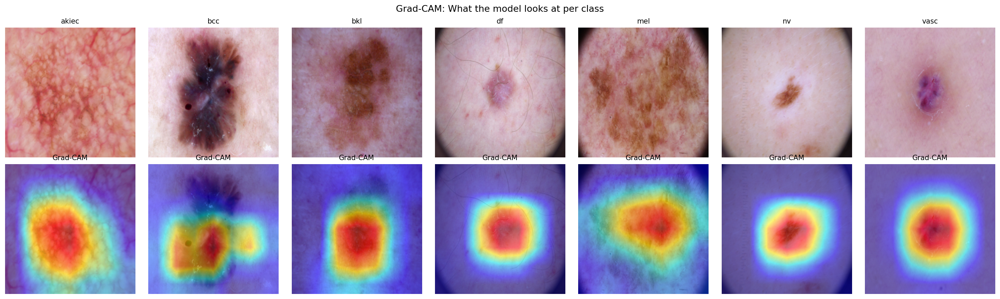
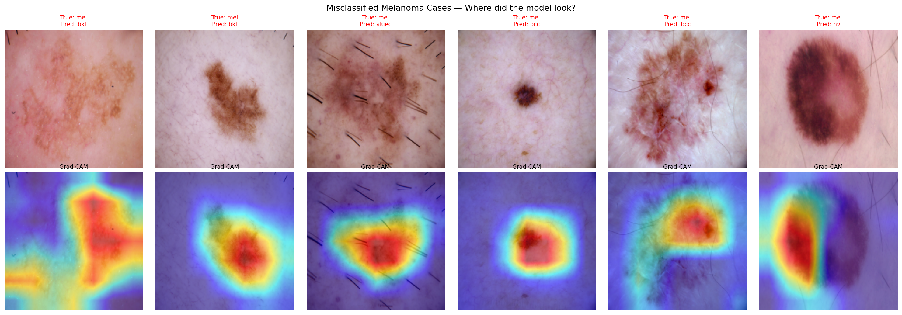
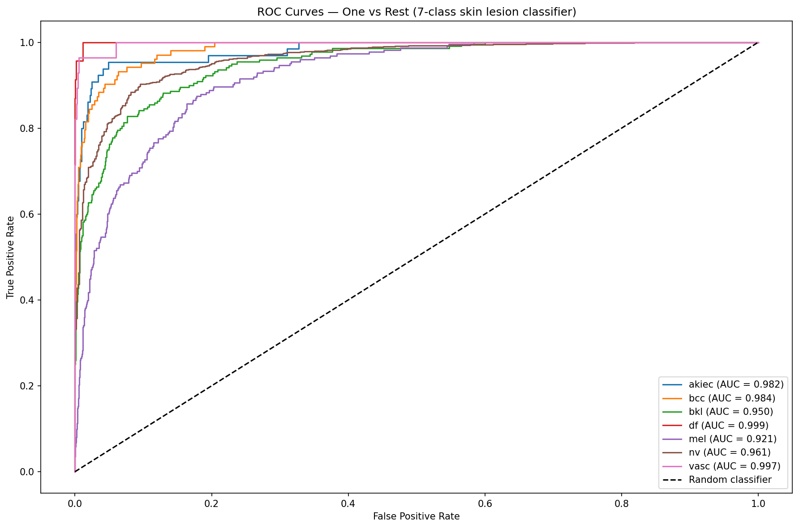
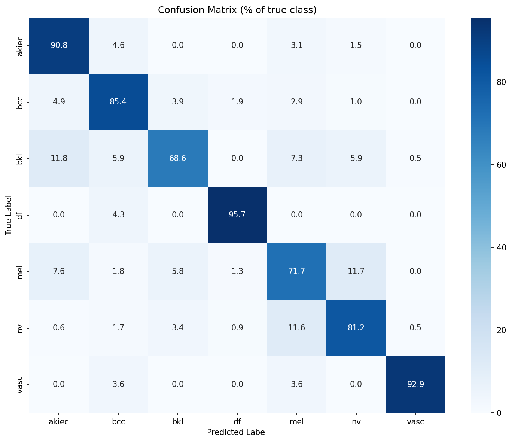

# Skin Lesion Classification with Interpretable Deep Learning
### HAM10000 Dataset — 7-Class Dermatoscopic Image Classifier

   

---

## Project Overview

This project develops a **7-class skin lesion classifier** using transfer learning on the HAM10000 dataset (10,015 dermatoscopic images). It extends my prior published work on interpretable AI for clinical outcomes — including cervical cancer risk prediction and ICU patient outcome modelling — into the **image domain**.

The same core principles from my published research are applied here:
- Class imbalance handling
- Discriminative evaluation metrics (AUROC, balanced accuracy)
- Model interpretability (Grad-CAM, equivalent to SHAP for images)

> **Important framing:** This is a research/educational classifier, not a diagnostic tool. Clinical deployment would require prospective validation, dermatologist oversight, and regulatory approval.

---

## Dataset

| Property | Detail |
|----------|--------|
| Name | HAM10000 (Human Against Machine with 10000 training images) |
| Source | [Kaggle — skin-cancer-mnist-ham10000](https://www.kaggle.com/datasets/kmader/skin-cancer-mnist-ham10000) |
| Total images | 10,015 dermatoscopic images |
| Classes | 7 skin lesion types |
| Key challenge | Severe class imbalance (nv: 66.9% vs df: 1.1%) |

### Class Distribution

| Code | Condition | Type | Count | % |
|------|-----------|------|-------|---|
| nv | Melanocytic nevi (mole) | Benign | 6705 | 66.9% |
| mel | Melanoma | Malignant | 1113 | 11.1% |
| bkl | Benign keratosis-like lesions | Benign | 1099 | 11.0% |
| bcc | Basal cell carcinoma | Malignant | 514 | 5.1% |
| akiec | Actinic keratoses | Pre-cancerous | 327 | 3.3% |
| vasc | Vascular lesions | Benign | 142 | 1.4% |
| df | Dermatofibroma | Benign | 115 | 1.1% |

---

## Methodology

### Architecture
- **Base model:** ResNet50 pretrained on ImageNet (transfer learning)
- **Final layer replaced:** 2048 → 7 output classes
- **Device:** NVIDIA GPU (CUDA)

### Handling Class Imbalance
Rather than oversampling (SMOTE is not directly applicable to image data), a **weighted cross-entropy loss function** was used — assigning higher penalty to mistakes on rare classes:

| Class | Weight |
|-------|--------|
| df | 12.441 |
| vasc | 10.040 |
| akiec | 4.369 |
| bcc | 2.785 |
| bkl | 1.302 |
| mel | 1.286 |
| nv | 0.213 |

### Training Configuration
| Parameter | Value |
|-----------|-------|
| Optimiser | Adam (lr=1e-4) |
| Loss | Weighted CrossEntropyLoss |
| Scheduler | ReduceLROnPlateau (patience=2) |
| Epochs | 10 |
| Batch size | 32 |
| Image size | 224×224 |
| Split | 80% train / 20% test (stratified) |

### Data Augmentation (Training only)
- Random horizontal and vertical flips
- Random rotation (±20°)
- Colour jitter (brightness, contrast)
- ImageNet normalisation

---

## Results

### Training History

| Epoch | Train Loss | Val Loss | Balanced Accuracy |
|-------|-----------|----------|-------------------|
| 1 | 1.1400 | 1.0173 | 0.6535 |
| 3 | 0.7765 | 0.7269 | 0.7462 |
| 5 | 0.5949 | 0.5866 | 0.7816 |
| 8 | 0.5376 | 0.6217 | 0.7879 |
| 10 | 0.3659 | 0.5199 | 0.8376 |

### Per-Class Performance

| Class | Precision | Recall | F1-Score | AUC |
|-------|-----------|--------|----------|-----|
| akiec | 0.51 | 0.91 | 0.66 | 0.982 |
| bcc | 0.66 | 0.85 | 0.75 | 0.984 |
| bkl | 0.71 | 0.69 | 0.70 | 0.950 |
| df | 0.56 | 0.96 | 0.71 | 0.999 |
| mel | 0.47 | 0.72 | 0.57 | 0.921 |
| nv | 0.96 | 0.81 | 0.88 | 0.961 |
| vasc | 0.76 | 0.93 | 0.84 | 0.997 |

**Overall accuracy: 80% | Balanced accuracy: 83.8%**

---

## Visualisations

### Grad-CAM — Correct Predictions
Heatmaps showing which regions the model focused on per class. Red = highest attention.

The model consistently focuses on the **lesion itself** rather than surrounding skin, confirming it learned clinically relevant visual features.

### Grad-CAM — Misclassified Melanoma Cases

Analysis of melanoma misclassifications revealed two key failure modes:
1. **Visual overlap** — some melanomas are visually indistinguishable from bkl or nv even to human observers
2. **Imaging artefacts** — body hair distracted model attention away from the lesion (visible in column 3)

### ROC Curves (One vs Rest)

All classes achieve AUC > 0.92, with df (0.999) and vasc (0.997) near-perfect despite being the two smallest classes — demonstrating the effectiveness of weighted loss.

### Confusion Matrix

---

## Key Findings

1. **Weighted loss successfully compensated for class imbalance** — df (only 92 training images) achieved 95.7% recall and AUC of 0.999

2. **Melanoma is the hardest class** — AUC of 0.921 but recall of only 71.7%, with 11.7% of melanomas misclassified as benign nevi. This is the most clinically dangerous failure mode.

3. **The AUC vs recall gap for melanoma is instructive** — high AUC (0.921) indicates strong discriminative ability, but lower recall (71.7%) suggests the decision threshold could be optimised specifically for melanoma to reduce missed cases.

4. **Grad-CAM confirms model focuses on lesions, not background** — supporting the clinical validity of learned features.

---

## Limitations

- No external validation dataset — results may not generalise beyond HAM10000
- Patient-level data splitting was not performed — the same patient may appear in both train and test sets, potentially inflating metrics
- Threshold optimisation per class was not explored
- Clinical deployment would require prospective validation and regulatory approval

---

## Research Context

This project directly extends methodology from my published work:

| Paper | Connection |
|-------|-----------|
| Cervical cancer risk prediction (SMOTE/ADASYN) | Same class imbalance problem, image equivalent via weighted loss |
| ICU patient outcome modelling (AUROC/AUPRC) | Same evaluation framework applied to 7-class ROC analysis |

The balanced accuracy of 83.8% is consistent with published HAM10000 benchmarks (typically 0.80–0.87).

